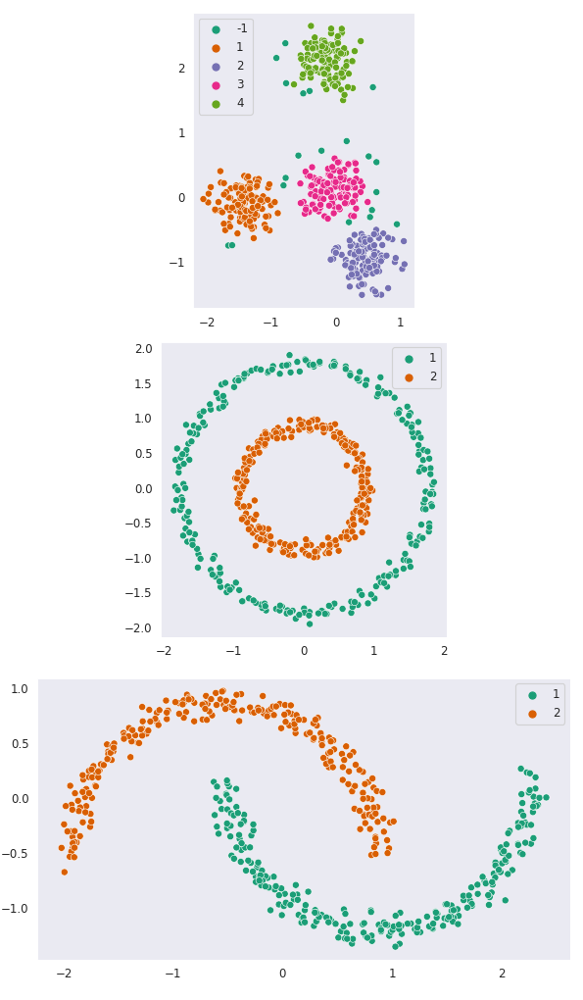

# debs

Simple [NumPy](https://numpy.org/) implementation of [DBSCAN](https://en.wikipedia.org/wiki/DBSCAN).

Needed things
---
*   [Nix](https://nixos.org/download.html)

Quick start
---
```
$ nix-shell
[nix-shell:path/to/debs]$ python src/main.py && feh out/plot.png
```

<div align="center"></div>
